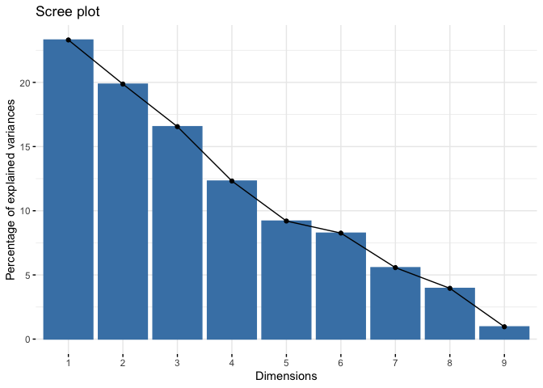
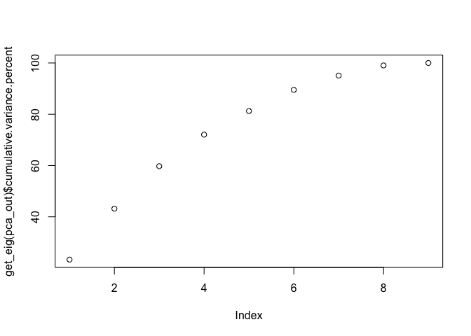
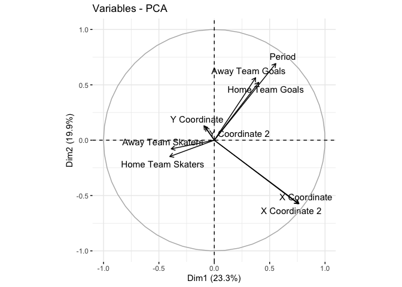
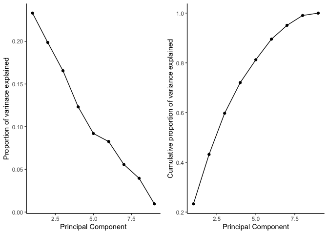
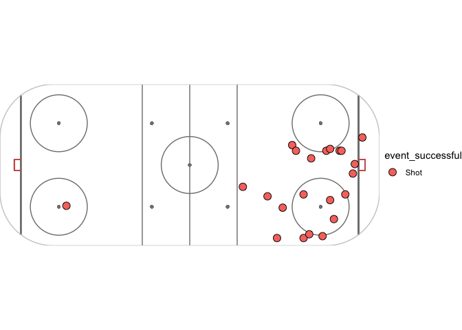
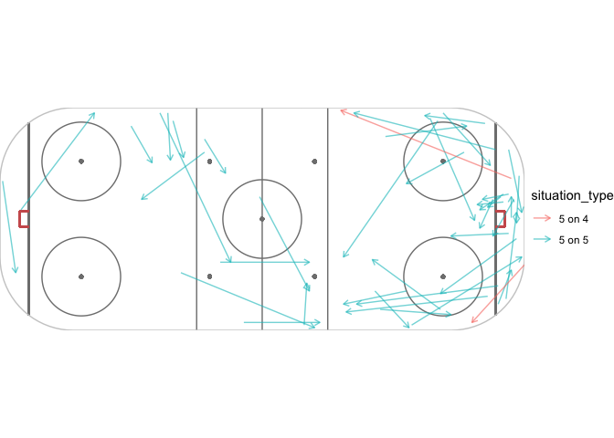

Mini Project 3 - Spatial Mini Project
================
Zefan Qian, Tom Liu

## Introduction

Ice hockey is one of the fastest and most complex team sports in the
world. However, the complexity of ice hockey is not adequately reflected
in the performance diagnostic and the relationship between off-ice and
on-ice performance is unclear. Consequently, the internal validity and
the ability to predict on-ice performance for the majority of
nonspecific office tests is insufficient. (Schulze et al. 2020).

In order to secure a goal, two pivotal aspects should be considered.
Firstly, how is the overall skill of a player? Do they exhibit mastery
of the ball, such that it will follow their movement? Secondly, how is
the position of the goal, as well as the series of movements before the
goal was made? In other words, if the ball is served with haste or the
attempts to goal is faced with imminent threat, then will it be less
likely to score than a somewhat planned attack? And are there any other
characteristics of the goals exhibited by the data? We will use
techniques in machine learning and correlated data modelling to answer
our questions.

    ## # A tibble: 6 × 9
    ##   Period `Home Team Skaters` `Away Team Skate… `Home Team Goal… `Away Team Goal…
    ##    <dbl>               <dbl>             <dbl>            <dbl>            <dbl>
    ## 1      1                   5                 5                0                0
    ## 2      1                   5                 5                0                0
    ## 3      1                   5                 5                0                0
    ## 4      1                   5                 5                0                0
    ## 5      1                   5                 5                0                0
    ## 6      1                   5                 5                0                0
    ## # … with 4 more variables: X Coordinate <dbl>, Y Coordinate <dbl>,
    ## #   X Coordinate 2 <dbl>, Y Coordinate 2 <dbl>

<!-- --><!-- --><!-- --><!-- -->

``` r
spooner_passes = olyn %>%
  filter(event == "Play") %>%
  filter(player_name == "Natalie Spooner")


## CREATING NEW VARIABLES ##

# Find pass distances
pass_data = olyn %>%
  filter(event == "Play") %>%
  mutate(pass_distance = sqrt((x_coord - x_coord_2)^2 + (y_coord - y_coord_2)^2))


pass_counts = olyn %>%
  filter(event == "Play") %>%
  group_by(player_name) %>%
  count()


# What was their completion rate on these passes?
pass_counts = olyn %>%
  filter(event == "Play") %>%
  mutate(event_successful = ifelse(event_successful == "t", TRUE, FALSE)) %>%
  group_by(player_name) %>%
  summarize(event_successful = mean(event_successful), count = n())


## PLOTTING THE DATA ##

# # Install packages to run the plot_rink function if you haven't already
 install.packages("ggforce")
```

    ## Installing package into '/Users/hliu3/Library/R/x86_64/4.1/library'
    ## (as 'lib' is unspecified)

    ## Error in contrib.url(repos, "source"): trying to use CRAN without setting a mirror

``` r
 install.packages("cowplot")
```

    ## Installing package into '/Users/hliu3/Library/R/x86_64/4.1/library'
    ## (as 'lib' is unspecified)

    ## Error in contrib.url(repos, "source"): trying to use CRAN without setting a mirror

``` r
# Source in function to create the rink plot in ggplot
source("OTTHAC_Tutorial/Code/plot_rink.R")


# Let's plot Alina Muller's shots throughout the 2022 olynpics
muller_shots = olyn %>%
  filter(event %in% c("Shot", "Goal")) %>%
  filter(player_name == "Alina Muller") %>%
  mutate(event_successful = ifelse(event_successful == "t", "Goal", "Shot"))

plot_rink(ggplot(muller_shots)) +
  geom_point(aes(x = x_coord, y = y_coord, fill = event_successful), shape = 21, size = 3.5)
```

    ## Loading required package: ggforce

    ## Registered S3 method overwritten by 'ggforce':
    ##   method           from 
    ##   scale_type.units units

    ## Loading required package: cowplot

<!-- -->

``` r
# What if we return to Natalie Spooner's passes, can we plot that?
plot_rink(ggplot(spooner_passes)) +
  geom_segment(aes(x = x_coord, xend = x_coord_2, y = y_coord, yend = y_coord_2, colour = situation_type), alpha = 0.6, arrow = arrow(length = unit(0.07, "inches")))
```

<!-- -->

## Data

Describe the data source and the data itself.

Describe the variables of interest and how they were measured.

## Methods

Describe and justify the statistical methods used in enough detail that
the analysis could be replicated, citing original authors for methods
and R packages used. Describe model selection process and criteria used
to evaluate models. (**dempster\_maximum\_1977?**)

``` r
#read in data
#clean data
```

## Results

Tables, graphics, and statistics, Oh my!

Talk about the results, but don’t tie it to your main question/topic.

Stick to facts and observations.

## Conclusions

Connect and hypothesize about results in larger context. Talk about what
you learn about the topic from your results.

Discuss limitations of methods.

## Acknowledgements

Thank individuals who helped make this work possible.

To do the references, build a Bibtex file (.bib) by creating a New File
(text file) in RStudio and Save as Library.bib. It is the easiest to use
Google Scholar to get the entries for the Bibtex file. Look for quotes
and press Bibtex. Copy and past into a .bib file. Check out
Bibliographic Information at <https://en.wikipedia.org/wiki/BibTeX>.

Check out how to include citations into Rmarkdown files at this site:
<https://rmarkdown.rstudio.com/authoring_bibliographies_and_citations.html>

## References

<div id="refs" class="references csl-bib-body hanging-indent">

<div id="ref-Rene_position_2013" class="csl-entry">

Schulze, Stephan, Kevin Laudner, Karl Delank, Richard Brill, and René
Schwesig. 2020. “Reference Data by Player Position for an Ice
Hockey-Specific Complex Test.” *Applied Sciences* 11 (December): 280.
<https://doi.org/10.3390/app11010280>.

</div>

</div>
